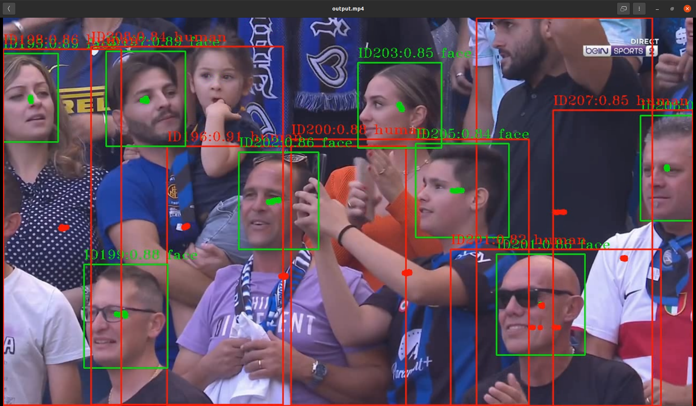

# Human Detection and Tracking Project



## Overview

This personal project focuses on human detection and tracking using computer vision techniques. The primary objective is to identify and track human subjects in video streams or sequences of images, with potential applications in surveillance, robotics, and more. The project utilizes popular deep learning models and libraries to achieve precise human detection and tracking.

## Features

- **Human Detection:** Identifies and localizes humans within images or video frames.
- **Human Tracking:** Tracks detected humans across multiple frames to maintain their identity.
- **Real-time Processing:** Designed for real-time operation with live video streams.
- **Modular Design:** Easily extendable with different detection and tracking algorithms.
- **Visualization:** Provides visual feedback with bounding boxes around detected humans and tracking paths.

## Installation

1. **Clone the repository:**

```shell
 git clone https://github.com/yourusername/human-detection-tracking.git
 cd human-detection-tracking
```

4. **Create a virtual environment (optional but recommended):**

```shell
python -m venv venv
source venv/bin/activate  # On Windows, use `venv\Scripts\activate`
```

3. **Install dependencies:**

```shell
python -m venv venv
pip install -r requirements.txt
```

## Usage

1. Configuration: Modify the configuration file config.yaml to set your preferred detection and tracking algorithms, camera sources, and other parameters.
2. Run the Application:

```shell
python run_tracker_simple.py
```

3. View Output: The application will display the video stream with bounding boxes around detected humans and tracking paths (if enabled).

## Configuration

The config.yaml file allows you to customize various aspects of the application, including:

- Detection model selection (e.g., YOLO, SSD, Faster R-CNN).
- Tracking algorithm (e.g., Kalman filter, SORT, DeepSORT).
- Video source (camera feed or video file).
- Thresholds for detection confidence and tracking.

## Contributing

Contributions are welcome! Feel free to fork the repository, make improvements, and submit pull requests. Please follow the Contributing Guidelines.

## License

This project is licensed under the MIT License. See the LICENSE file for details.

## Contact

If you have any questions or suggestions, please feel free to contact me:

Email: vankhoa21991@gmail.com
GitHub: github.com/vankhoa21991
Thank you for your interest in this project! Happy coding! 🚀
